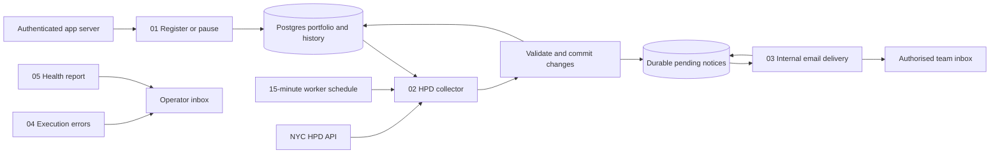

# BlockSignal n8n automation package

Prepared implementation, not an installed service. All five workflows are inactive and contain no credentials, recipients, sample customer portfolios or pinned records. n8n deployment was deferred. These exports have not been imported or executed on a real n8n instance.

## Customer experience and scope

The intended experience is: save a property in the application, enable monitoring once, then review dated, source-linked changes without daily file uploads. An authenticated server integration must connect the application to workflow 01 before that experience is live. The current browser Save property button still uses local storage; this package does not claim to have connected it automatically.

Implemented source: open HPD violation records for actual matched HPD building IDs. This is most directly useful to property managers and to agents/brokers watching a specific building's record. It does not find buyers, establish seller intent, monitor listings, assess market prices or automatically create repair tasks. PLUTO, ACRIS and DOB remain in the research interface where supported; scheduled monitoring of those sources requires separate collectors and source-specific completeness rules.

Example of intended operation: after a successful baseline for a watched building, a later complete snapshot includes a newly observed class C record. The database records the change and pending internal notice together. The notice includes the property, HPD building ID, record ID, recorded description, observation time and official source. The recipient verifies the source and assigns the operational action through their normal system. Class C is a source classification used to prioritize review, not a new legal conclusion or verified current deadline.



## Importable workflows

| File | Purpose | Configuration required |
| --- | --- | --- |
| [01-property-watch.json](01-property-watch.json) | Authenticated POST registration or reversible pause of a building watch. | Header Auth, fixed workspace ID, Postgres credential. |
| [02-hpd-collector.json](02-hpd-collector.json) | Claim due buildings, request HPD, validate, compare and commit history plus pending notices. | Same workspace ID and Postgres credential. |
| [03-internal-notices.json](03-internal-notices.json) | Claim pending notices, send plain-text internal emails and persist acceptance/failure. | Same workspace ID, Postgres, SMTP, authorised sender and recipient. |
| [04-execution-errors.json](04-execution-errors.json) | Alert the operator to unexpected workflow failures without forwarding raw error payloads. | Workspace ID, SMTP, operator sender/recipient; select it in other workflows' Error workflow setting. |
| [05-health-report.json](05-health-report.json) | Report stale collector activity, source failures, overdue checks and undelivered/exhausted notices. | Workspace ID, Postgres, SMTP, operator sender/recipient. |

Each configuration rejects its `REPLACE_*` placeholders. Assign credentials in n8n, never in GitHub exports or browser JavaScript. The workspace is fixed inside each workflow; the webhook ignores a workspace identifier supplied in its request body. One workspace represents one authorised internal team. Database partition keys alone are not multi-tenant user authentication or row-level isolation.

## State, collection and failure behavior

- [schema.sql](schema.sql) creates portfolio, event history, outbox and collector-health tables, plus parameterized database functions. It is additive and must be applied as a database owner in a dedicated database.
- Workers claim up to ten due properties every 15 minutes, using atomic `FOR UPDATE SKIP LOCKED` claims and expiring 30-minute leases. An individual property is normally due every 24 hours. The 15-minute worker interval does not imply HPD publishes new data every 15 minutes.
- Network requests have a 45-second timeout and up to three attempts with five-second waits. One source failure does not stop subsequent properties; database or unexpected execution errors stop the workflow and require operator attention.
- A successful first snapshot establishes a baseline without fabricating historical changes. Later checks identify newly observed open records, class/status/status-date changes and records no longer returned as open. Description-only edits do not currently generate a change event.
- The source query asks for 1,001 rows. An overflow above 1,000, malformed body, duplicate ID, unexpected building ID or non-open row rejects the snapshot. There is no pagination beyond this bound: large buildings require a paginated collector before onboarding. Do not silently truncate them.
- Source failures retain the last successful snapshot and retry the property after 90 minutes. Three consecutive failures create one outage notice per episode. Recovery produces an observation-gap notice. Source data may lag physical conditions; observation time is not event time.
- Snapshot changes, event history and the outbox are committed in the same database transaction. Mail failure cannot erase a detected change. Expired or replaced leases reject stale writes.
- Delivery workers claim ten notices every five minutes. Backoff is 2, 10, 30, 120 and 360 minutes, with at most five claims per notice. A process crash consumes an attempt; leases expire and allow recovery. Exhausted notices remain stored and visible in the operational report.
- A pause keeps history, invalidates the property lease and cancels pending notices without deleting them. A message already in transit can still arrive. Resuming monitoring retains the baseline; cancelled historical notices do not automatically resend.
- SMTP acceptance is checked against the configured recipient, but it does not prove inbox delivery. A crash or timeout after sending and before acknowledgment can duplicate an email. Stable notice IDs support investigation; this is at-least-once delivery, not exactly-once delivery. An idempotent delivery provider is required if duplicate suppression at the provider boundary is mandatory.

## Installation and app connection

1. Provision a supported PostgreSQL database and a dedicated non-superuser n8n login. Apply `schema.sql` as its owner; review the migration before execution. Back up the database and test restoration separately from n8n workflow backups.
2. Grant that login USAGE on schema `blocksignal`, SELECT/INSERT/UPDATE on its four tables, USAGE/SELECT on its identity sequences and EXECUTE on its functions. Do not grant schema ownership, DROP, DELETE, superuser privileges or browser access. Use verified TLS for remote database and SMTP connections.
3. Import workflows 01–05 into a current n8n version supporting Postgres v2.6, HTTP Request v4.2, Loop Over Items v3 and Send Email v2.1. Set one actual workspace ID consistently in every Configuration/validator node. Use actual authorised sender/recipient addresses for notification workflows; start with your own test inbox.
4. Assign Postgres, SMTP and Webhook Header Auth credentials in n8n. Select imported workflow 04 as the Error workflow for 01, 02, 03 and 05. Its imported workflow ID is instance-specific and cannot be prelinked here. Do not select it as its own handler.
5. Connect a server-side application gateway to workflow 01. The gateway must authenticate the application's user and authorise their workspace before forwarding requests. Keep the n8n URL, Header Auth secret and workspace mapping on the server. A public Netlify page must not embed that shared secret. Account authentication and this gateway are outstanding app integration work, not configured by these files.
6. An authorised gateway sends `POST /webhook/blocksignal/property-watch` with `{ "buildingId": "<actual matched HPD ID>", "address": "<actual address>", "action": "watch" }`. Pause uses the same actual ID and `action: "pause"`. Invalid input fails before a database write. The endpoint is a watch-setting API, not a bulk CSV upload.
7. Test with authorised fixtures, verify the source response on an actual saved building, verify baseline persistence across executions, and follow the acceptance checks below. Publish only the schedules and internal recipients agreed for that installation. No instance, schedule or recipient has been activated in this repository work.

For a multi-tenant service, add authenticated account membership, tenant-isolated credentials/data policies, rate and portfolio limits, a verified app gateway and access-controlled report APIs. This bounded internal-team package is not a complete SaaS backend.

## Operations and acceptance

Error Trigger reports unexpected execution failures; it cannot report a dead host or SMTP failure through the same failed SMTP service. Configure an independent external uptime/heartbeat monitor for n8n availability and collector completion. If self-hosted, retain and back up the n8n encryption key, configure HTTPS and authentication, pin a supported version, prune execution data according to the team's retention policy, and test upgrades in staging. Queue mode/Redis and extra workers should follow measured load; SQL leases are still required.

The health workflow runs daily at 08:00 America/New_York and stays silent when its checks are healthy. Source outage notices and pending-delivery processing use their own schedules. Before installation acceptance, verify:

1. An authenticated actual app save reaches the correct workspace; an unauthorised request is rejected. This cannot be accepted until the gateway/account integration exists.
2. The first complete source snapshot stores a baseline; unchanged snapshots create no notice.
3. A controlled new class C/status change produces one committed event and source-linked pending notice. Disappearing records say verification is needed, not that a repair was completed.
4. A source timeout, malformed response and >1,000 rows retain the baseline; other buildings continue processing.
5. A delivery failure retains the notice, a later acceptance acknowledges it, and five failed claims leave an operationally visible exhausted notice.
6. An expired collector/delivery worker cannot commit over a new lease. Test concurrent workers on the target PostgreSQL deployment; the local single-connection test engine cannot establish multi-connection behavior.
7. A pause suppresses pending notices while preserving history. Test resume and execution-error routing.
8. Stop the collector, database and SMTP separately in staging. Confirm independent operational detection, operator routing and backup restoration.

## Local validation and regeneration

```sh
npm ci
npm test
node scripts/export-automation.mjs
node scripts/verify-automation-source.mjs <actual-HPD-building-ID>
```

Source verification needs internet access and prints only the actual fetched record count/classes. It does not write a baseline or send notifications. On Windows with a trusted inspection certificate, Node's system trust store can be enabled with `NODE_USE_SYSTEM_CA=1`; do not disable certificate verification.

The test suite runs the actual migration and functions in an embedded PostgreSQL engine (PGlite), using synthetic QA inputs only. It exercises baseline integrity, atomic event/outbox writes, malformed inputs, overlapping/replaced leases, outages/recovery, delivery retries, pauses and notice wording. It also compiles every exported Code node and checks workflow connections. This does not replace actual n8n import, item-linking, HTTP/SMTP credential, scheduling or concurrent database deployment tests.

## Primary references

- Parameterized Postgres node queries: https://docs.n8n.io/integrations/builtin/app-nodes/n8n-nodes-base.postgres/
- HTTP retry configuration: https://docs.n8n.io/integrations/builtin/core-nodes/n8n-nodes-base.httprequest/common-issues/
- Loop Over Items outputs: https://docs.n8n.io/integrations/builtin/core-nodes/n8n-nodes-base.splitinbatches/
- SMTP Send Email: https://docs.n8n.io/integrations/builtin/core-nodes/n8n-nodes-base.sendemail/
- Error workflow assignment: https://docs.n8n.io/build/flow-logic/handle-errors-gracefully.md
- Row locks and transaction behavior: https://www.postgresql.org/docs/current/explicit-locking.html
- Local PostgreSQL test engine: https://pglite.dev/docs/
